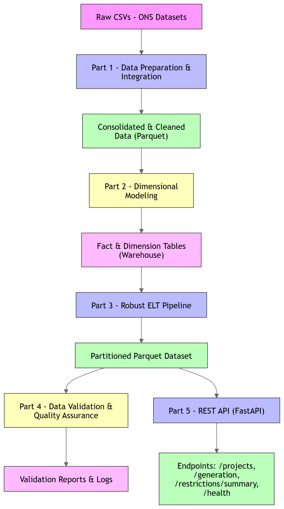

# Environment Setup

## 1. Create a virtual environment

```bash
python -m venv venv
```

---

## 2. Activate the virtual environment

### Windows (PowerShell)

```bash
venv\Scripts\activate
```

---

## 3. Install project dependencies

```bash
pip install -r requirements.txt
```

---

# First Part - Data Preparation and Integration

## Automated Data Collection

This step downloads the monthly CSV files for both datasets:

- `https://dados.ons.org.br/dataset/restricao_coff_eolica_usi`
- `https://dados.ons.org.br/dataset/restricao_coff_eolica_detail`

---

### Running the Download Script

Choose the desired date range and execute the script using the following format:

```bash
python src/extract/download_data.py --start YYYY-MM --end YYYY-MM
```

---

### Example

```bash
python src/extract/download_data.py --start 2025-10 --end 2026-03
```

This command downloads all monthly files between October 2025 and March 2026 for both datasets.

---

### Output

Files are saved in:

- data/raw/wind_farm/
- data/raw/spe/

---

## Data Consolidation

This step consolidates all monthly CSV files into unified datasets.

---

### Running the Consolidation Script

Execute the following command from the project root:

```bash
python src/transform/consolidate_data.py
```
---

### Output

Files are saved in:

- data/interim/spe_consolidated.csv
- data/interim/wind_farm_consolidated.csv

---

## Data Quality 

This step is responsible for ensuring the reliability and consistency of the consolidated datasets. The pipeline performs data validation, cleansing, and generates a structured data quality report.

---

### Running the Data Quality Script

Execute the following command from the project root:

```bash
python python src/transform/data_quality.py
```
---

### Output

Files are saved in:

- data/processed/spe_clean.csv
- data/processed/wind_farm_clean.csv
- data/reports/data_quality_report.json

---

## Casa dos Ventos Filtering

This step filters the dataset to keep only SPEs belonging to Casa dos Ventos and their associated wind farm complexes.

---

### Running the Filtering Script

Execute the following command from the project root:

```bash
python src/transform/filter_cdv.py
```

---

### Output

Files are saved in:

- data/filtered/spe_cdv_filtered.csv
- data/filtered/wind_cdv_filtered.csv

---

## Dataset Join Strategy

The SPE detail dataset and the Wind Farm dataset were joined using a business key based on the wind complex name.

### Join Key Investigation

Although both datasets contain the `id_ons` column, the field represents different hierarchical entities:

- In the SPE dataset, `id_ons` identifies the individual SPE.
- In the Wind Farm dataset, `id_ons` identifies the wind complex.

Because of this semantic mismatch, `id_ons` was not used as the join key.

After investigating the available columns, the logical relationship between datasets was identified as:

```text
spe.nom_conjuntousina ↔ wind.nom_usina
```

Example:

```text
Conj. Paulino Neves ↔ CONJ. PAULINO NEVES
```

To guarantee matching consistency, both fields were normalized by:

- converting text to uppercase
- trimming spaces
- removing duplicated spaces

---

### Join Type

A `LEFT JOIN` strategy was used, preserving the SPE dataset as the primary granular layer.

This approach guarantees that:

- all SPE records remain in the final dataset
- Wind Farm information is added whenever a valid match exists

The final dataset therefore keeps the original SPE granularity while enriching records with aggregated Wind Farm attributes.

---

### Cardinality Handling

The Wind Farm dataset contains multiple temporal records for the same wind complex. To avoid a many-to-many merge explosion and excessive memory usage, duplicates were removed before the join using the normalized business key.

---

### Selected Wind Farm Attributes

The following columns from the Wind Farm dataset were incorporated into the final joined dataset:

- `nom_subsistema`
- `nom_estado`
- `val_geracao`
- `val_disponibilidade`
- `val_geracaoreferencia`
- `val_geracaoreferenciafinal`
- `cod_razaorestricao`

Operational restriction fields such as:

- `val_geracaolimitada`
- `cod_origemrestricao`
- `dsc_restricao`

were intentionally excluded from the final dataset to keep the model focused on generation and availability metrics.

---

### Possible Merge Losses

Potential merge losses may occur due to:

- naming inconsistencies between datasets
- missing or malformed wind complex names
- unmatched normalized keys

Join quality metrics were calculated to validate merge coverage and identify unmatched records.

---

### Running the Dataset Join Script

Execute the following command from the project root:

```bash
python src/transform/join_spe_wind.py
```

---

### Output

File is saved in:

- data/processed/cdv_spe_wind_joined.csv

---

## Data Persistence

The final consolidated dataset was persisted in **Parquet** format using partitioning by:

- `year`
- `month`

Both columns were extracted from `din_instante`.

---

### Partition Strategy

The dataset was partitioned by time (`year/month`) because the data represents time-series energy generation records.

This strategy improves performance for queries filtered by temporal windows, such as:

- monthly analysis
- yearly reports
- historical comparisons

---

### Running the Persistence Script

Execute the following command from the project root:

```bash
python src/load/save_parquet.py
```

---

### Output 

The partitioned Parquet dataset will be saved to:

- data/final_parquet/

Example structure:

```text
data/final_parquet/
├── year=2025/
│   ├── month=10/
│   ├── month=11/
│   └── month=12/
│
└── year=2026/
    ├── month=1/
    ├── month=2/
    └── month=3/
```

---

## Premises and Design Decisions

- Data is sourced from ONS public datasets (wind farms and SPEs) and assumed to be accurate.
- Only SPEs belonging to Casa dos Ventos are included in the final dataset.
- `id_ons` columns in the two datasets represent different levels of hierarchy, the join uses normalized names (`nom_conjuntousina` ↔ `nom_usina`) to ensure consistency.
- A LEFT JOIN preserves SPE granularity while enriching with wind farm attributes.
- Duplicates in wind farm data are removed to prevent many-to-many merge issues.
- Partitioning by `year` and `month` in Parquet files improves query performance for temporal analysis.

# Second Part — Dimensional Modeling

## Dimensional Model

A dimensional model following the **Star Schema** approach was designed for the constrained-off wind generation domain.

The model separates:

- **Fact table** → generation and operational metrics
- **Dimension tables** → descriptive business context

---

### Fact Table

#### `fact_generation`

The fact table stores the wind generation measurements and operational metrics.

#### Granularity

The chosen granularity is:

> One record per SPE per timestamp (`din_instante`).

This granularity preserves the original detail level from the SPE dataset and allows temporal analysis at the individual wind plant level.

---

#### Metrics

The following metrics were included:

- `val_ventoverificado`
- `val_geracaoestimada`
- `val_geracaoverificada`
- `val_geracao`
- `val_disponibilidade`
- `val_geracaoreferencia`
- `val_geracaoreferenciafinal`
- `cod_razaorestricao`

---

#### Foreign Keys

The fact table contains the following foreign keys:

- `spe_key`
- `conjunto_key`
- `tempo_key`

---

### Dimension Tables

#### `dim_spe`

Stores descriptive information about individual SPEs.

##### Attributes

- `spe_key` (Primary Key)
- `nom_usina`
- `id_ons`
- `ceg`
- `projeto`
- `nom_modalidadeoperacao`

---

#### `dim_conjunto`

Stores information about wind complexes/conjuntos.

##### Attributes

- `conjunto_key` (Primary Key)
- `nom_conjuntousina`
- `id_subsistema`
- `nom_subsistema`
- `id_estado`
- `nom_estado`

---

#### `dim_tempo`

Stores temporal attributes extracted from `din_instante`.

##### Attributes

- `tempo_key` (Primary Key)
- `din_instante`
- `ano`
- `mes`
- `dia`
- `hora`

---

### Relationships

The dimensional model relationships are:

- `fact_generation.spe_key` → `dim_spe.spe_key`
- `fact_generation.conjunto_key` → `dim_conjunto.conjunto_key`
- `fact_generation.tempo_key` → `dim_tempo.tempo_key`

---

### Running the Modeling Script

Execute the following command from the project root:

```bash
python src/modeling/build_star_schema.py
```

---

### Output

The generated dimensional model tables will be saved to:

- data/warehouse/

Structure:

```text
data/
└── warehouse/
    ├── dimensions/
    │   ├── dim_spe.parquet
    │   ├── dim_conjunto.parquet
    │   └── dim_tempo.parquet
    │
    └── facts/
        └── fact_generation.parquet
```

---

## Design Decisions

### Fact Table Granularity

The fact table granularity was defined as:

> One record per SPE per timestamp (`din_instante`).

This granularity was chosen because the SPE dataset already represents the most detailed operational level available in the source data.

Using this level of detail allows:

- temporal analysis of wind generation
- comparisons between SPEs
- project-level aggregations
- future analytical flexibility without losing information

It also preserves the original business semantics of the ONS detailed dataset.

---

### Slowly Changing Dimensions (SCD)

At the current scope of the project, there is no strong need for Slowly Changing Dimensions.

The descriptive attributes used in the dimensions are relatively stable, such as:

- project
- SPE
- conjunto
- subsystem
- state

However, in a production-grade environment, some dimensions could eventually require:

#### SCD Type 2

Especially for attributes that may change historically over time, such as:

- project ownership
- operational classification
- regional organization

SCD Type 2 would preserve historical versions of the records while maintaining analytical consistency over time.

For this project, dimensions were implemented as static snapshots.

---

### Denormalization Decisions

A small amount of denormalization was intentionally applied in the dimensional model.

For example:

- subsystem information
- state information

were kept directly inside `dim_conjunto`.

This decision was made because:

- these attributes have low cardinality
- they rarely change
- it simplifies analytical queries
- it reduces unnecessary joins

The goal was to prioritize simplicity and query performance while maintaining a clean star schema structure.

---

### Modeling Strategy Summary

The dimensional model was designed to:

- preserve the SPE-level analytical granularity
- optimize BI and aggregation queries
- reduce redundancy in the fact table
- simplify analytical exploration
- follow common Data Warehouse best practices

---

## Model Implementation

The dimensional model was implemented programmatically using:

- Python
- Pandas
- Parquet

The implementation consumes the consolidated dataset generated in Part 1 and transforms it into a Star Schema structure composed of:

- dimension tables
- fact table

---

### Input Dataset

The modeling process uses the following dataset:

```text
data/processed/cdv_spe_wind_joined.csv
```

---

### Generated Tables

#### Dimension Tables

- `dim_spe.parquet`
- `dim_conjunto.parquet`
- `dim_tempo.parquet`

Saved in:

- data/warehouse/dimensions/

---

#### Fact Table

- `fact_generation.parquet`

Saved in:

- data/warehouse/facts/

---

## Premises and Design Decisions

- Star Schema was chosen to optimize analytical queries.
- Fact table granularity is SPE per timestamp to preserve operational detail for temporal analysis.
- `cod_razaorestricao` is included in the fact table to allow restriction-level aggregations.
- All IDs and keys are surrogate keys to maintain referential integrity and simplify joins.

# Third Part — Robust ELT Pipeline

In this stage, the original scripts from the first part were refactored into a modular and robust ELT pipeline following software engineering best practices.

The pipeline was designed with clear separation between extraction, loading, and transformation layers, using DuckDB as the analytical processing engine.

---

## ELT Architecture

The pipeline follows the ELT approach:

```text
Extract → Load → Transform
```
---

### Extract

Raw CSV files are downloaded directly from the public AWS S3 bucket provided by ONS.

### Load

The raw files are loaded into DuckDB without prior transformation.

### Transform

All transformations are executed inside DuckDB using SQL.

---

## Pipeline Structure

```text
src/
│
├── extract/
│   └── extract_data.py
│
├── load/
│   └── load_duckdb.py
│
├── transform/
│   ├── transform_duckdb.py
│   ├── quality_report.py
│   ├── filter_cdv_duckdb.py
│   ├── join_data.py
│   └── export_parquet.py
│
├── utils/
│   └── logger.py
│
└── pipeline.py
```

---

## Pipeline Execution

Run the pipeline with:

```bash
python -m src.pipeline
```

---

## Pipeline Steps

### 1. Extract

Downloads monthly files for both datasets:

- Wind farm dataset
- SPE detail dataset

Features implemented:

- Retry mechanism for download failures
- Informative logging
- Skip download if file already exists

---

### 2. Load

Loads all raw CSV files into DuckDB tables. The loading process consolidates all monthly files automatically.

---

### 3. Transform

Transformations are executed directly inside DuckDB.

---

### 4. Data Quality Report

A detailed quality report is generated and is saved in:

- data/reports/data_quality_report_pipeline.json

---

### 5. Casa dos Ventos Filtering

The pipeline filters only Casa dos Ventos SPEs using the mapping file:

```text
spes_casa_dos_ventos.csv
```

---

### 6. Dataset Join

The SPE dataset is related to the wind farm dataset using the logical business key:

- `nom_conjuntousina`
- `nom_usina`
- `din_instante`

Join type:

- `LEFT JOIN`

---

### 7. Parquet Persistence

The final dataset is exported in partitioned Parquet format.

Partition strategy:

- `year`
- `month`

Output is saved in:

- data/final_parquet_pipeline/

---

## Idempotency

The pipeline can be safely re-executed without duplicating data because:

- Existing files are not downloaded again
- DuckDB tables use `CREATE OR REPLACE`
- Final parquet export overwrites previous partitions safely

---

## Logging

The project uses Python's `logging` module.

Implemented log levels:

- INFO
- WARNING
- ERROR

Logs are saved to:

- logs/pipeline.log

---

## Error Handling

The pipeline implements:

- Retry for download failures
- Informative error messages

---

## Configuration

Pipeline parameters are centralized in:

- config/settings.py

---

## Pipeline Orchestration

In a production environment, this pipeline could be orchestrated with the main goal of automating execution, monitoring, retries, scheduling, and failure notifications.

---

### Architecture

A possible production architecture would be:

```text id="hsk4xp"
Cloud Scheduler / Airflow
            ↓
      Pipeline Trigger
            ↓
      Extract Layer
            ↓
       DuckDB Load
            ↓
      SQL Transformations
            ↓
   Data Quality Validation
            ↓
     Final Parquet Export
            ↓
     Data Lake / Storage
```

---

### Airflow Orchestration Example

Using Apache Airflow, the pipeline could be separated into independent tasks:

1. `extract_task`

   * Download monthly CSV files

2. `load_task`

   * Load raw files into DuckDB

3. `transform_task`

   * Execute SQL transformations

4. `quality_task`

   * Generate quality report

5. `filter_task`

   * Filter Casa dos Ventos assets

6. `join_task`

   * Join datasets

7. `export_task`

   * Export partitioned parquet files

Task dependencies would guarantee the correct execution order.

---

### Scheduling Strategy

The pipeline could run automatically:

- Daily
- Weekly
- Monthly

For the ONS constrained-off datasets, a monthly schedule would likely be sufficient.

---

### Failure Recovery

The orchestration layer would provide:

- Automatic retries
- Failure alerts
- Execution logs
- Task monitoring
- Dependency management

This improves reliability and operational visibility.

---

### Scalability Considerations

Although the current project uses local DuckDB processing, the architecture could be adapted to cloud environments using:

- Amazon S3
- Google Cloud Storage
- BigQuery
- Databricks

---

### Why This Approach

This orchestration strategy was chosen because it provides:

- Modular execution
- Easier maintenance
- Better observability
- Automatic scheduling
- Fault tolerance
- Scalability for larger datasets

---

## Premises and Design Decisions

- DuckDB was chosen for in-memory analytical processing to efficiently handle the CSV datasets.
- ELT approach (Extract → Load → Transform) ensures raw data is preserved and transformations are reproducible.
- `cod_razaorestricao` is preserved through transformations and joins to enable restriction-level analysis downstream.
- All transformations are performed in SQL to leverage DuckDB performance.
- Idempotency is ensured by using `CREATE OR REPLACE` and partitioned Parquet exports, allowing safe re-execution.
- Logging and error handling are centralized to improve observability and operational monitoring.
- Partitioning by `year` and `month` optimizes query performance for time-series analytics.

# Fourth Part - Data Validation and Quality Assurance

This stage of the project focuses on ensuring the reliability, consistency, and integrity of the data.

An automated validation pipeline was implemented to verify:

- Schema consistency
- Data freshness
- Business rules
- Timestamp continuity
- Data completeness

The validations are executed over the partitioned parquet dataset stored in:

- data/final_parquet_pipeline/

The pipeline generates validation logs and a JSON report containing all validation results.

---

## Validation Pipeline Structure

```text
src/
└── validation/
    ├── __init__.py
    └── validate_pipeline.py
```

Generated outputs:

```text
logs/
└── validate_pipeline_YYYYMMDD_HHMMSS.log

data/
└── validation_reports/
    └── validation_report.json
```

---

## Implemented Validations

### 1. Schema Validation

The pipeline verifies whether:

- All expected columns exist
- Column data types are correct

---

### 2. Freshness Check

The pipeline validates whether the latest expected month is present in the dataset.

---

### 3. Business Rules Validation

The following business rules were implemented:

- Power generation cannot be negative
- Wind speed must be between 0 and 40 m/s
- Generation cannot exceed reference generation
- Duplicate timestamps are not allowed
- Projects cannot be null
- Timestamp continuity is verified for each project

---

### 4. Timestamp Continuity Validation

The pipeline checks for unexpected timestamp gaps for each project.

---

### 5. Completeness Validation

The pipeline calculates the percentage of expected timestamps versus received timestamps for each project.

Projects below the configured threshold are automatically flagged.

Configured threshold:

```text
threshold = 95
```

---

## Running the Validation Pipeline

Run the validation pipeline with:

```bash
python -m src.validation.validate_pipeline
```

---

## Validation Report

After execution, the pipeline automatically generates:

- data/validation_reports/validation_report.json

This report contains:

- Schema validation results
- Freshness validation
- Business rule violations
- Timestamp continuity analysis
- Completeness percentages
- Threshold alerts

---

## Technologies Used

- Python
- Pandas
- PyArrow
- JSON
- Logging

---

## Premises and Design Decisions

- Validation pipeline focuses on **data reliability, consistency, and completeness** for analytical use.
- Partitioned Parquet datasets enable efficient validation over time-series data.
- Validations are modular (schema, freshness, business rules, timestamp continuity, completeness) to simplify maintenance.
- Logging and JSON reports improve **traceability, observability, and reproducibility**.
- The pipeline is idempotent, it can be re-run without affecting the original dataset.
- Design assumes hourly frequency in timestamps, gaps are considered anomalies.


# Fifth Part — Data Serving (REST API)

In this stage, the processed and modeled datasets are exposed through a **REST API built with FastAPI**, enabling external consumption of analytical results.

The API provides endpoints for querying wind generation data, project metadata, and restriction summaries.

---

## API Framework

The API was built using:

- FastAPI
- Pydantic (validation)
- Pandas (data processing)
- Parquet (data source)

FastAPI was chosen due to:

- Automatic Swagger/OpenAPI documentation
- High performance
- Built-in validation system

---

## Running the API

To start the API locally:

```bash
uvicorn src.api.app:app --reload
```

---

After starting the service, access:

```text
http://127.0.0.1:8000/docs
```

FastAPI automatically generates:

- Swagger UI
- OpenAPI schema
- Interactive endpoint testing

---

## Project Structure (API Layer)

```text
src/api/
│
├── app.py
├── routes.py
├── services.py
└── schemas.py
```

---

## Endpoints

---

### 1. Health Check

#### GET /health

Returns API health status.

---

### 2. Projects

#### GET /projects

Returns available wind generation projects with metadata.

---

### 3. Generation Data

#### GET /generation/{project_id}

Returns aggregated generation data for a project.

#### Query Parameters

- project_id (required)
- start_date (optional)
- end_date (optional)
- frequency: daily | monthly

---

### 4. Restrictions Summary

#### GET /restrictions/summary

Returns a summary of generation restrictions grouped by restriction reason (`cod_razaorestricao`).

---

#### Filters (optional)

- project_id
- start_date
- end_date

---

## Technical Features

### Automatic Documentation
- Swagger UI at `/docs`
- OpenAPI schema generated automatically

---

### Input Validation
- Path and query parameters validated with Pydantic
- Invalid inputs return HTTP 400

---

### Error Handling
- 404 for missing projects
- 400 for invalid parameters
- Safe handling of null values

---

### Data Source

The API reads from:

- data/final_parquet_pipeline/

Generated from previous pipeline stages.

---

## Premises and Design Decisions

- The API exposes only the pre-processed and modeled datasets.
- Null values in cod_razaorestricao can be categorized as "without restriction".
- Aggregations for generation and restrictions are performed at query-time using Pandas.
- Swagger/OpenAPI documentation ensures discoverability and testing without external tools.
- All business logic validation is done in the pipeline stage, the API serves read-only data.
- The design follows a modular structure to allow future extension (new endpoints or filters).

# Sixth Part — Documentation

This section documents the architecture, technical decisions, and potential cloud evolution for the project.

---

## Architecture Diagram



---

## Technical Decisions

- DuckDB: Chosen for fast, local analytical processing with Parquet support, simpler than full-fledged databases for this dataset size;
- Parquet Partitioning: Partitioned by year and month to optimize time-based queries;
- Left Join Strategy: Preserves all SPE records, enriches with wind farm data, avoids data loss;
- Star Schema: Fact table at SPE-timestamp granularity, dimensions for descriptive context, balances query performance and simplicity;
- FastAPI: Provides REST API with automatic Swagger/OpenAPI documentation and easy validation;
- Validation Pipeline: Automated checks for schema, completeness, and business rules to ensure data reliability.

---

## 3. Cloud Evolution Proposal

To scale and deploy this solution in production:

1. **Compute Layer**
   - Use **GCP Cloud Run** or **AWS Fargate** to host the API and ETL pipeline.
   - Containerized Python environment for portability.

2. **Storage**
   - Move final Parquet datasets to **Google Cloud Storage (GCS)**, replacing the local `data/` folder.

3. **Data Warehouse**
   - Load Parquet into **BigQuery** for fast analytical queries and aggregation.

4. **Orchestration**
   - Schedule the ETL pipeline with **Cloud Scheduler** or **Airflow in Cloud Composer**.
   - Monitor logs, retries, and failure notifications automatically.

5. **API Layer**
   - Cloud Run exposes FastAPI endpoints.
   - Can connect directly to BigQuery for live queries if the dataset grows beyond local DuckDB feasibility.

6. **Monitoring & Alerts**
   - Use **Cloud Monitoring** and **Cloud Logging** to track ETL runs, API health, and data freshness.
   - Alert for failures or schema drift.

This approach allows scaling with dataset growth, ensures fault tolerance, and simplifies operational management in the cloud.